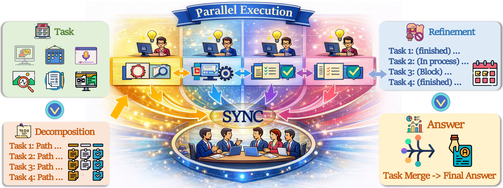
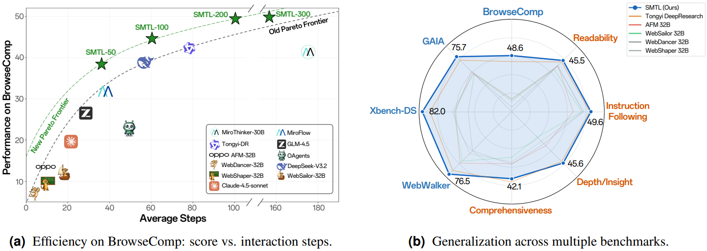

<div align="center">

<h2>Search More, Think Less: Rethinking Long-Horizon Agentic Search for Efficiency and Generalization</h2>

<h4>OPPO PersonalAI Lab</h4>

</div>

<div align="center">
  <a href="https://arxiv.org/abs/2602.22675"></a>
  <a href="https://huggingface.co/PersonalAILab/SMTL-30B"></a>
  <a href="LICENSE"></a>
</div>

<br>

This is the official repository for our paper **"Search More, Think Less: Rethinking Long-Horizon Agentic Search for Efficiency and Generalization"**. We challenge the prevailing assumption that more thinking leads to better performance in agentic search. Instead, we find that **search-heavy, think-light** strategies achieve superior efficiency and generalization on long-horizon web tasks. By shifting the compute budget from internal chain-of-thought reasoning toward more active web exploration, SMTL delivers competitive performance across challenging benchmarks while significantly reducing inference cost.

We fully open-source our **data synthesis pipeline**, **data construction workflow**, **model weights**, and **inference code** to support reproducible research.

---

# Overview

Recent advances in deep research agents suggest that scaling reasoning depth and tool calls can substantially improve task performance. However, this reliance on linear, sequential reasoning leads to high inference costs and latency in search-intensive scenarios. Furthermore, existing agents often struggle to generalize across diverse task objectives—from deterministic question-answering with clear ground-truth answers to open-ended research problems requiring comprehensive synthesis.

To balance long-horizon search performance and computational efficiency, we propose:

- **Search More, Think Less (SMTL)**: A unified agentic framework that replaces sequential reasoning with parallel task decomposition and concurrent tool execution, utilizing plan-driven context management for efficient long-horizon inference under constrained budgets.

- **Unified Data Synthesis Pipeline**: An automated data pipeline that constructs representative multi-type search tasks spanning both deterministic and open-ended settings, reducing redundant samples and teaching generalized research behavior.

<div align="center">
  
</div>

# SOTA Performance

Trained end-to-end using supervised fine-tuning (SFT) and reinforcement learning (RL), our SMTL agent achieves SOTA performance across multiple deep search and deep research benchmarks, while drastically improving computational efficiency.

**Superior Accuracy**: SMTL achieves strong, state-of-the-art results across diverse evaluation settings, including 48.6% on BrowseComp, 75.7% on GAIA, 82.0% on Xbench, and 45.9% on DeepResearch Bench.

**Exceptional Efficiency**: Compared to baselines like Mirothinker-v1.0, SMTL substantially reduces the average number of reasoning steps by up to 78% on BrowseComp and cuts inference latency by up to 2.6×, all while improving overall accuracy.

<div align="center">
  
</div>

We fully open-source our data synthesis pipeline, data construction workflow, model weights, and inference code to ensure the reproducibility of our results. For more details, please refer to our [Technical Report](https://arxiv.org/abs/2602.22675).

---

# Quick Feature Summary

| Feature Category | Supported Capabilities |
| - | - |
| **Inference Pipeline** | ✅ Long-horizon web-agent inference<br>✅ Multi-step reasoning with tool calls<br>✅ Background launch via `start_infer.sh` |
| **Tool Integration** | ✅ Web search and crawling servers<br>✅ Service status / restart / log utilities |
| **Deployment** | ✅ vLLM model deployment script<br>✅ Single-server default setup |
| **Configuration** | ✅ CLI overrides for core inference hyperparameters<br>✅ Environment-variable-based endpoint and key config |
| **Statistics** | ✅ Per-result `.output_stats.txt` generation |

---

# Table of Contents

- [Overview](#overview)
- [SOTA Performance](#sota-performance)
- [Quick Feature Summary](#quick-feature-summary)
- [Table of Contents](#table-of-contents)
- [Project Layout](#project-layout)
- [Running Examples](#running-examples)
  - [1. Environment Preparation](#1-environment-preparation)
  - [2. Download Model Checkpoint](#2-download-model-checkpoint)
  - [3. Tool Server Deployment](#3-tool-server-deployment)
  - [4. Model Service Deployment (vLLM)](#4-model-service-deployment-vllm)
  - [5. Inference Launch (Recommended)](#5-inference-launch-recommended)
  - [6. Runtime Parameters in `start_infer.sh`](#6-runtime-parameters-in-start_infersh)
  - [7. Single-Question Quick Test](#7-single-question-quick-test)
- [Configuration Notes](#configuration-notes)
- [FAQ](#faq)
- [Acknowledgement](#acknowledgement)
- [Related Work](#related-work)
- [Citation](#citation)
- [Star](#star)

---

# Project Layout

```text
SMTL-main/
├─ .env                          ← fill in your API keys here
├─ .env.example                  ← template (copy to .env)
├─ data_synthesis/
├─ data_workflow/
├─ deploy/
│  ├─ tool_servers/
│  │  ├─ start_servers.sh
│  │  └─ scripts/
│  └─ vllm_model/
│     └─ model_deploy.sh
├─ inference/
│  ├─ start_infer.sh
│  ├─ inference_web_agent.py
│  ├─ cal_stats.py
│  ├─ benchmarks/
│  └─ logs/
├─ model/
│  └─ smtl
└─ requirements.txt
```

---

# Running Examples

### 1. Environment Preparation

Create and activate a conda environment:

```bash
conda create -n smtl python=3.11 -y
conda activate smtl
```

Install all dependencies:

```bash
pip install -r requirements.txt
```

---

### 2. Download Model Checkpoint

Download the SMTL-30B model from Hugging Face into the `model/smtl` directory:

```bash
mkdir -p model/smtl
huggingface-cli download PersonalAILab/SMTL-30B --local-dir model/smtl
```

Or with `git lfs`:

```bash
git lfs install
git clone https://huggingface.co/PersonalAILab/SMTL-30B model/smtl
```

> Model page: [https://huggingface.co/PersonalAILab/SMTL-30B](https://huggingface.co/PersonalAILab/SMTL-30B)

#### 2.1 Download Tokenizer

To ensure the agent functions correctly, you must download the Qwen3-4B model (used for the tokenizer) into the designated local directory:

```bash
mkdir -p /home/notebook/code/group/cjy/AFM/tokenizer/qwen3/Qwen3-4B

huggingface-cli download Qwen/Qwen3-4B \
  --local-dir /home/notebook/code/group/cjy/AFM/tokenizer/qwen3/Qwen3-4B \
  --local-dir-use-symlinks False
```

---

### 3. Tool Server Deployment

`start_servers.sh` loads configuration from the project root `.env`.  
At minimum, set `SERVER_HOST`, `CRAWL_PAGE_PORT`, and `WEBSEARCH_PORT` in that file.

Start services:

```bash
bash deploy/tool_servers/start_servers.sh start
```

Useful commands:

```bash
bash deploy/tool_servers/start_servers.sh status
bash deploy/tool_servers/start_servers.sh stop
bash deploy/tool_servers/start_servers.sh restart
bash deploy/tool_servers/start_servers.sh log all
```

---

### 4. Model Service Deployment (vLLM)

```bash
bash deploy/vllm_model/model_deploy.sh
```

Default serving target:

- model: `smtl`
- host: `0.0.0.0`
- port: `1`

---

### 5. Inference Launch (Recommended)

After tool servers and model service are ready, launch inference:

```bash
bash inference/start_infer.sh
```

This command will:

- load `.env` from project root
- run inference in the background (`nohup`)
- write logs to `inference/logs/infer_log.log` by default

---

### 6. Runtime Parameters in `start_infer.sh`

Override runtime config without modifying Python files:

```bash
# Single URL
bash inference/start_infer.sh \
  --model-url http://0.0.0.0:1/v1 \
  --max-steps 100 \
  --benchmark browsecomp \
  --parallel 4 \
  --web-topk 20 \
  --log-file inference/logs/infer_log.log

# Multiple URLs (round-robin load balancing)
bash inference/start_infer.sh \
  --model-url "http://0.0.0.0:1/v1,http://0.0.0.0:2/v1" \
  --parallel 8
```

Supported options:

| Option | Description | Default |
| - | - | - |
| `--model-url <url(s)>` | Model base URL(s); comma-separated for round-robin across multiple instances | `http://0.0.0.0:1/v1` |
| `--max-steps <int>` | Max reasoning steps per query | `100` |
| `--benchmark <name>` | Benchmark name (see available list below) | `browsecomp` |
| `--parallel <int>` | Parallel workers | `4` |
| `--web-topk <int>` | `web_search` top-k results | `20` |
| `--log-file <path>` | Log file path | `inference/logs/infer_log.log` |

Available benchmarks: `browsecomp`, `gaia`, `xbench`, `webwalker`, `frames`, `seal_0`

For each inference result file `xxx.jsonl`, judge result statistics are automatically generated as:

- `xxx.output_stats.txt`

---

# Single-Question Quick Test

To verify your deployment with a single question (without running a full benchmark), use the quick test script:

### Interactive mode (prompts for input)
python inference/test.py

### Pass question directly via CLI
python inference/test.py --question "Who won the 2024 Nobel Prize in Physics?"

### Override model URL at runtime
python inference/test.py \
  --model-url http://0.0.0.0:1/v1 \
  --question "What is the capital of France?"

The script prints the model's answer, total reasoning steps, and elapsed time. It suppresses verbose inference logs by default — set logging.WARNING → logging.INFO inside the script to enable debug output.
> Prerequisites: tool servers and model service must already be running, and .env must be filled in.

---

# Configuration Notes

### `.env` (project root)

Copy `.env.example` to `.env` and fill in your credentials:

```bash
cp .env.example .env
```

Then edit `.env` and replace all placeholder values with your own keys.

**Required API keys to run this project:**
| Key | Where to obtain |
| - | - |
| `JINA_API_KEY` | [https://jina.ai](https://jina.ai) — used by the CrawlPage tool server to fetch web page content |
| `WEB_SEARCH_SERPER_API_KEY` | [https://serper.dev](https://serper.dev) — used by the WebSearch tool server for web search |
| `API_KEY` | Your judge model API key (e.g. DeepSeek) — used to evaluate agent responses |
| `BASE_URL` | API endpoint for the judge model |

> ⚠️ The project **cannot run** without valid `JINA_API_KEY` and `WEB_SEARCH_SERPER_API_KEY`. Please obtain these keys before starting the tool servers.


### Inference Script Entry

Use `inference/start_infer.sh` as the standard entrypoint for all inference experiments.

---

# FAQ

### Inference runs but output is invalid or empty. What should I check?

1. Tool servers are up: `bash deploy/tool_servers/start_servers.sh status`
2. vLLM model service is reachable at the configured URL
3. URLs in `.env` match actual host/ports

### Where are logs?

- Inference: `inference/logs/infer_log.log`
- Tool servers: `deploy/tool_servers/logs/`
- Model serving: `deploy/vllm_model/logs/`

---

## Related Work
Listed below are friendly links to relevant agents works from OPPO PersonalAI Lab:

- [Adaptive_Agent_Foundation_Models](https://github.com/OPPO-PersonalAI/Adaptive_Agent_Foundation_Models): An Adaptive Agent Foundation Model for Tool-Aware Hybrid Reasoning
- [Flash-Searcher](https://github.com/OPPO-PersonalAI/Flash-Searcher): Fast and Effective Web Agents via DAG-Based Parallel Execution
- [Agent Foundation Models](https://github.com/OPPO-PersonalAI/Agent_Foundation_Models): Chain-of-Agents: End-to-End Agent Foundation Models via Multi-Agent Distillation and Agentic RL
- [TaskCraft](https://github.com/OPPO-PersonalAI/TaskCraft): Automated Generation of Agentic Tasks
- [OAgents](https://github.com/OPPO-PersonalAI/OAgents): An Empirical Study of Building Effective Agents
- [Agent-KB](https://github.com/OPPO-PersonalAI/Agent-KB): Leveraging Cross-Domain Experience for Agentic Problem Solving
- [MiCoTA](https://github.com/OPPO-PersonalAI/MiCoTA): Bridging the Learnability Gap with Intermediate CoT and Teacher Assistants

# Citation

If you find `SMTL` useful in your research or applications, please consider citing our work:

```bibtex
@misc{chen2026searchmorethinkless,
      title={Search More, Think Less: Rethinking Long-Horizon Agentic Search for Efficiency and Generalization},
      author={Qianben Chen and Tianrui Qin and King Zhu and Qiexiang Wang and Chengjun Yu and Shu Xu and Jiaqi Wu and Jiayu Zhang and Xinpeng Liu and Xin Gui and Jingyi Cao and Piaohong Wang and Dingfeng Shi and He Zhu and Tiannan Wang and Yuqing Wang and Maojia Song and Tianyu Zheng and Ge Zhang and Jian Yang and Jiaheng Liu and Minghao Liu and Yuchen Eleanor Jiang and Wangchunshu Zhou},
      year={2026},
      eprint={2602.22675},
      archivePrefix={arXiv},
      primaryClass={cs.CL},
      url={https://arxiv.org/abs/2602.22675},
}
```

---

# Star

<div align="center">

[](https://github.com/OPPO-PersonalAI/SMTL)

</div>
